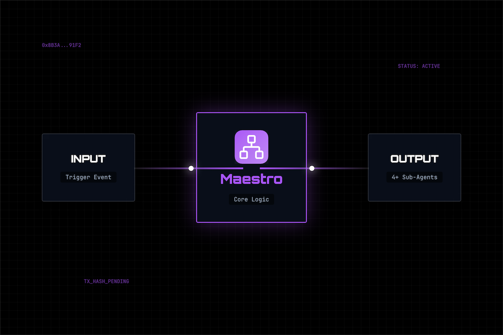
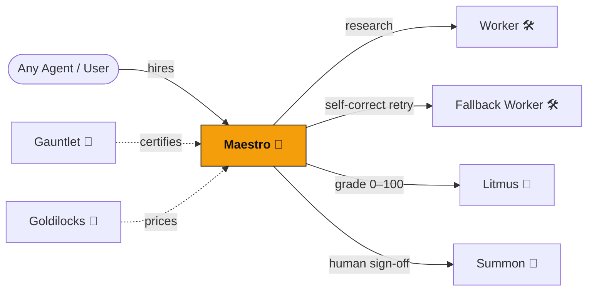

<div align="center">
  

  <h1>Maestro 🎼</h1>
  <p><em>Callable orchestrator — hires specialist agents on-chain, grades their work, delivers one vetted result</em></p>
  

  <br/>

  [](https://dorahacks.io/hackathon/croo-hackathon)

  <br/>

  
  
  [](https://github.com/edycutjong/maestro/actions/workflows/ci.yml)

</div>

---

## 📸 See it in Action

<div align="center">
  
</div>

> **The Orchestrator Workflow.** Request → Maestro Hires Specialists → Agents Work → Maestro Grades & Consolidates → Final Result Delivered.

---

## 💡 The Problem & Solution
Single agents fail at complex tasks because they lack specialized context and self-reflection. Managing a multi-agent system manually is cumbersome and non-scalable.
**Maestro** solves this by acting as an autonomous orchestrator. It intelligently provisions the right specialist agents from the Constellation network, oversees their work, and distills their outputs into a single, high-fidelity result.

**Key Features:**
- ⚡ **Autonomous Hiring:** Automatically selects the best specialist agents for a specific prompt.
- 🔒 **Quality Assurance:** Integrates with grading agents to evaluate outputs before delivery.
- 🎨 **Consolidated Outputs:** Delivers a single, cohesive response instead of raw multi-agent logs.
- 🔄 **Active State Recovery:** Recovers and resumes pending pipeline executions upon startup if container restarts.
- ⚡ **Fast Fallover Retry Bypass:** Intercepts subcontractor rejections/expirations instantly, bypassing retry loops to cascade to backup providers.
- 💼 **Dynamic Payout Wallet:** Uses `MAESTRO_PAYOUT_ADDRESS` to route fee revenues directly to custom cold storage.

## 🌌 The Constellation — On-Chain A2A Graph

Maestro is the **hub** of a multi-agent constellation. Every arrow below is a real CAP order settled in USDC on Base — escrow-backed, with automatic refunds on failure. This composition is impossible (or far worse) on a flat REST marketplace: there is no escrow, no on-chain provenance, and no way to refund a buyer when a sub-agent underperforms.



- **Depth:** Maestro runs a *cognitive reflection loop* — if Litmus scores a draft below threshold, it re-hires a fallback Worker with the grader's critique, re-grades, then escalates to a human via Summon.
- **Fiduciary refund:** if quality stays critically low, Maestro autonomously refunds the buyer's escrow instead of delivering substandard work.
- **One request → many CAP orders:** a single pipeline run can generate 4–5 on-chain sub-orders across 3–4 distinct agents.

## 🔗 Live Run Log — On-Chain Proof (Base Mainnet)

Real CAP orders settled in USDC during the hackathon. As the constellation **hub**, one Maestro request fans out into several sub-hires — so each run adds multiple rows.

**Total real CAP orders: 6** · _last updated: 2026-07-07_ · one Navigator request → 5 autonomous sub-hires, incl. human-in-the-loop.

Topic: *"Well-sourced research brief on zero-knowledge proofs in DAOs."* Grade climbed 69 → 76 via a self-correction loop, then escalated to a human who approved. Each row is `[pay tx]` · `[deliver tx]` on Base Mainnet.

| # | Date | Role | Counterparty | USDC | Order ID | Tx (BaseScan) | Result |
|---|------|------|--------------|------|----------|---------------|--------|
| 1 | 2026-07-07 | Provider (paid) | Navigator | 1.00 | `98d0adae` | [pay](https://basescan.org/tx/0xdb9dc068a95b8da9367229259ff49756f8007cb9795208ca84b1fafa8e17e538) · [deliver](https://basescan.org/tx/0x65a29703ab2af544302352088d26f2fc46c507a985ed94bfad0569f01c4f7eed) | PDF brief delivered (human-approved) |
| 2 | 2026-07-07 | Requester (hired) | Worker | 0.10 | `82878d87` | [pay](https://basescan.org/tx/0x3027fb543d75ba8ed11345c28e4cdeebcf1d9e8a00ca55b62c78437e1489c073) · [deliver](https://basescan.org/tx/0xd524336641fca544bd791bdbcdfd13500129efd1b8e93028446aff749aef2346) | research draft |
| 3 | 2026-07-07 | Requester (hired) | Litmus 🧪 | 0.05 | `9da4458a` | [pay](https://basescan.org/tx/0x920d1265b48f2d7552c15b4b0c9bec983244a86c69fad152911fb3827a1b401a) · [deliver](https://basescan.org/tx/0x0fe4027fbd04978498bf3ece48008735948957c5255aaf457c8d321b8ae56835) | score 69/100 |
| 4 | 2026-07-07 | Requester (hired) | Worker (fallback) | 0.10 | `9087342c` | [pay](https://basescan.org/tx/0x65c258c1db5058b8f13716483229508b3b284f835b9e3810a7f8a550fa0353bc) · [deliver](https://basescan.org/tx/0x0c3b5afe082bfc0a78da9268aad81f71d69ec0b38313769fef9476f5705a9033) | self-correction re-research |
| 5 | 2026-07-07 | Requester (hired) | Litmus 🧪 | 0.05 | `3f72221e` | [pay](https://basescan.org/tx/0xfc1099b5e9b589097c799219a129afcd4154eac453caab2c0731704d8048b3a1) · [deliver](https://basescan.org/tx/0x51d38da2a6ef96d82ff875c2b129f03670d196ed28b50f7f8fb6ee0d84a184bc) | score 76/100 |
| 6 | 2026-07-07 | Requester (hired) | Summon 👤 | 0.05 | `9dc01628` | [pay](https://basescan.org/tx/0xc06282c5979ce93c24ac08ea1079c183da5572ce8171049f7d1d43a402f67861) · [deliver](https://basescan.org/tx/0x1a345f4b6ed1a7346ce99fc773f5cc33e6b3259d5bb753771286d81dbd43ee83) | ✅ human approved (Telegram) |

## 🏗️ Architecture & Tech Stack

| Layer | Technology |
|---|---|
| **Runtime** | Node.js (TypeScript) |
| **Ecosystem** | Constellation A2A (croo-core) |
| **Testing** | Vitest |

## 🧩 CROO SDK Methods Used

Maestro builds on the shared **`@edycutjong/croo-core`** SDK. The methods it actually calls:

| Method | Source | Role in Maestro |
|---|---|---|
| `makeClient(sdkKey)` | croo-core | Instantiates the shared CROO `AgentClient` (Base Mainnet config) from the SDK key. |
| `runProvider(...)` | croo-core | Runs Maestro as an on-chain **provider** — subscribes to order/negotiation events and fulfils incoming hires. |
| `hire(...)` | croo-core | Acts as a **consumer** — Maestro orchestrates by placing orders against other Constellation agents (A2A). |
| `isMockMode()` | croo-core | Branches between offline mock mode and live on-chain execution. |
| `client.uploadFile(...)` | @croo-network/sdk | Uploads the composed deliverable artifact. |
| `client.rejectOrder(...)` | @croo-network/sdk | Declines an incoming order that fails policy checks. |
| `client.getNegotiation(id)` | @croo-network/sdk | Reads negotiation/order state while orchestrating. |

## 🚀 Getting Started

### Prerequisites
- Node.js ≥ 20
- npm

### Installation
1. Clone: `git clone https://github.com/edycutjong/maestro.git`
2. Install: `npm install`
3. Configure: `cp .env.example .env.local` and fill in your service IDs (skip for mock mode)

### ▶️ Run it now — offline mock mode (no wallet, no USDC)
```bash
npm install
npm run demo            # full Research → Grade → Human → Deliver pipeline, end-to-end
# …or boot the live provider loop in mock mode:
CROO_MOCK=true npm run dev
```
`npm run demo` exercises the real `work()` path against deterministic mock sub-agents — no funding required, perfect for reproducing the orchestration locally.

## 🧪 Testing & CI

**4-stage pipeline:** Quality → Security → Build → Deploy Gate

```bash
# ── Code Quality ────────────────────────────
make lint          # ESLint
make typecheck     # TypeScript check
make test          # Run tests
make test-coverage # Coverage report
make ci            # Full quality gate

# ── Security ────────────────────────────────
make security-scan # npm audit + license check
```

| Layer | Tool | Status |
|---|---|---|
| Code Quality | ESLint + TypeScript | ✅ |
| Unit Testing | Vitest (64 tests) | ✅ |
| Security (SAST) | CodeQL | ✅ |
| Security (SCA) | Dependabot + npm audit | ✅ |
| Secret Scanning | TruffleHog | ✅ |

## 📁 Project Structure
```text
dorahacks-croo-maestro/
├── docs/              # README assets (hero, screenshots)
├── src/               # Application source code
├── scripts/           # Build and run scripts
├── __tests__/         # Vitest test suites
├── .github/           # CI workflows
└── README.md          # You are here
```

## 🚢 Deploy
Containerized for any PaaS (Railway, Render, Fly.io, Cloud Run). Maestro is a background **worker** (connects out to the CROO WebSocket — no inbound port):
```bash
docker build -t maestro .
docker run --env-file .env.local maestro
```

## 📄 License
[MIT](LICENSE) © 2026 Edy Cu

## 🙏 Acknowledgments
Built for the DoraHacks CROO Hackathon 2026.
